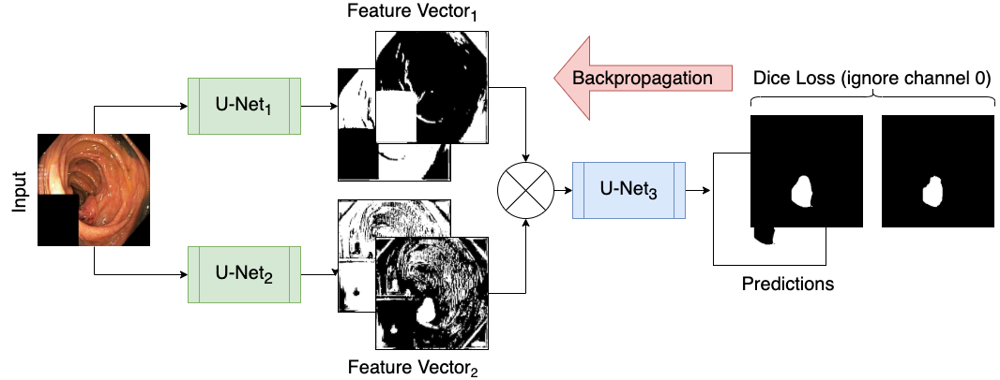
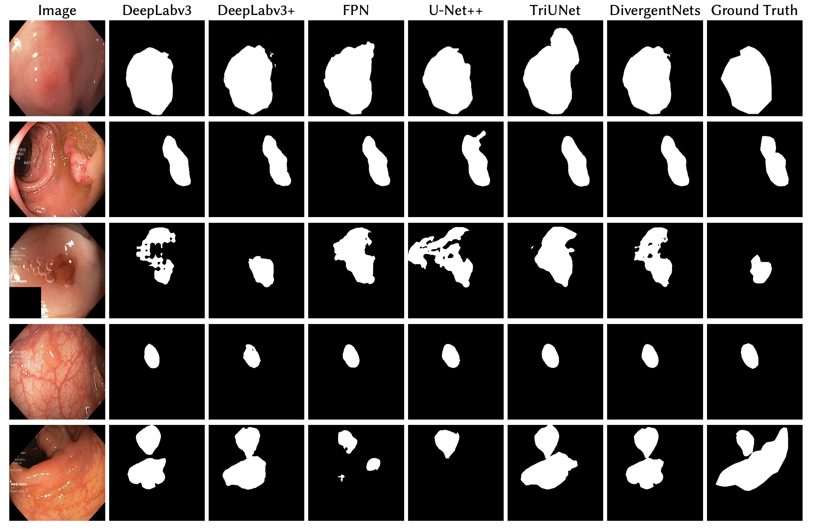

# Endocv2021-winner
This is the winning solution of the  Endocv-2021 grand challange. 

### Dependencies 

```python
pytorch # tested with 1.7 and 1.8
torchvision 
tqdm
pandas
numpy
albumentations # for augmentations
torchsummary
segmentation_models_pytorch # for basic segmentaion models
pyra_pytorch # pyra_pytorch.PYRADatasetFromDF is used. But this can be replaced with normal pytorch dataset.

```

## Tri-Unet

### Block diagram of Tri-Unet



### How to train Tri-Unet and other basic models to DivergentNet?

```python

# To train Tri-unet

python tri_unet.py train \
    --num_epochs 2 \
    --device_id 0  \
    --train_CSVs sample_CSV_files/C1.csv sample_CSV_files/C1.csv \
    --val_CSVs sample_CSV_files/C2.csv sample_CSV_files/C3.csv \
    --test_CSVs sample_CSV_files/C3.csv \
    --out_dir ../temp_data \
    --tensorboard_dir ../temp_data  

# To train other models, you have to replace tri_unet.py with one of the follwings:
unet_plusplus.py
deeplabv3.py
deeplabv3_plusplus.py
```
-------
## Pretrained checkpoint paths
- [https://github.com/vlbthambawita/divergent-net/releases/download/checkpoints_v1/best_checkpoint_Deeplabv3.pth](https://github.com/vlbthambawita/divergent-net/releases/download/checkpoints_v1/best_checkpoint_Deeplabv3.pth) 
- [https://github.com/vlbthambawita/divergent-net/releases/download/checkpoints_v1/best_checkpoint_Depplabv3_plusplus.pth](https://github.com/vlbthambawita/divergent-net/releases/download/checkpoints_v1/best_checkpoint_Depplabv3_plusplus.pth)
- [https://github.com/vlbthambawita/divergent-net/releases/download/checkpoints_v1/best_checkpoint_FPN.pth](https://github.com/vlbthambawita/divergent-net/releases/download/checkpoints_v1/best_checkpoint_FPN.pth)
- [https://github.com/vlbthambawita/divergent-net/releases/download/checkpoints_v1/best_checkpoint_TriUnet.pth](https://github.com/vlbthambawita/divergent-net/releases/download/checkpoints_v1/best_checkpoint_TriUnet.pth)
- [https://github.com/vlbthambawita/divergent-net/releases/download/checkpoints_v1/best_checkpoint_unet_plusplus.pth](https://github.com/vlbthambawita/divergent-net/releases/download/checkpoints_v1/best_checkpoint_unet_plusplus.pth)

-------
## DivergentNet


## Merging and predicting from divergent networks

Set following parameters in **inference_from_divergentNets.sh**

```bash
--input_dir <directory to input images>
--output_dir <directory to save predicted mask>
--chk_paths <path to pretrained checkpoints. You can provide single checkpoint path or multiple checkpoint paths. Use a space to seperate multiple checkpoint paths or '\' as the given example paths.>
```

Then run it:
```bash
bash inference_from_divergentNets.sh
```


-----

## Sample predictions from different models used in DivergentNets and it's own output.



## Citation
```python
TBA
```

## Contact us:

### [vajira@simula.no](vajira@simula.no), [steven@simula.no](steven@simula.no), [michael@simula.no](michael@simula.no)


